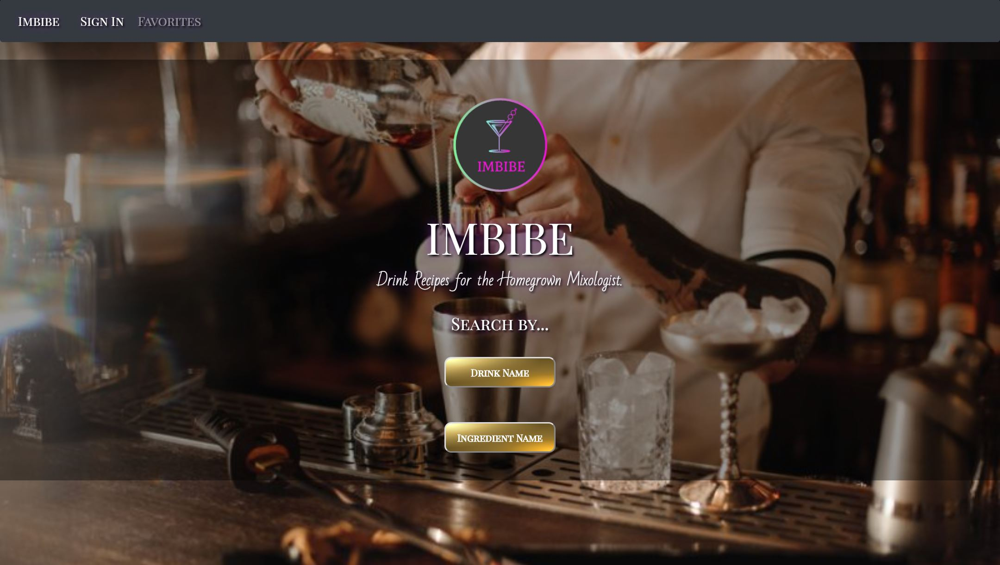

# project3-fun-project

#### IMBIBE

<i>Recipes for the Homegrown Mixologist - Drink Responsibly, Drink Often</i>

Our app is a tailored to users who want make their own drinks, whether it be alcoholic or not. The user has the ability to search drinks based on their names, for example <i>Whiskey Sour</i> or <i>Hot Chocolate</i>, or by ingredient. Additionally, if the user wants to save certain drinks, we have provided a favorites option.

<h2>Demo</h2>
Imbibe is deployed to Heroku. Please check it out <a href="https://mighty-shelf-13025.herokuapp.com/" target="_blank">here</a>.

<h2>Installation</h2>
To install the application follow the instructions below:
<ol>
    <li>git clone git@github.com:CodeYoga80s/project3-fun-project.git</li>
    <li>cd project3-fun-project</li>
    <li>npm install</li>

<h2>Run Locally</h2>
Once you have completed the installation, to access the application in your browser, first run <i>npm start</i> in your terminal within the <i>project3-fun-project</i> folder.

If done properly, your terminal should display the following, <i>Starting the development server...</i>, and the app should run on your local browser on <i>http://localhost:3000</i>.

<h2>Application</h2>

The app will look like the image below:

